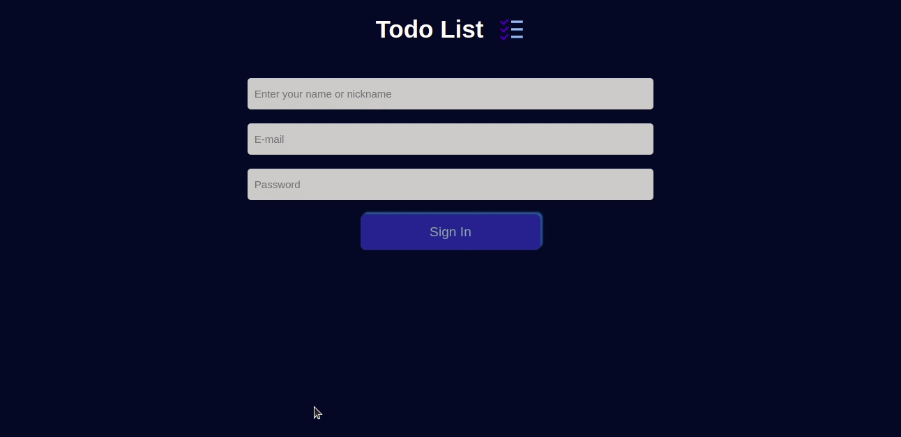
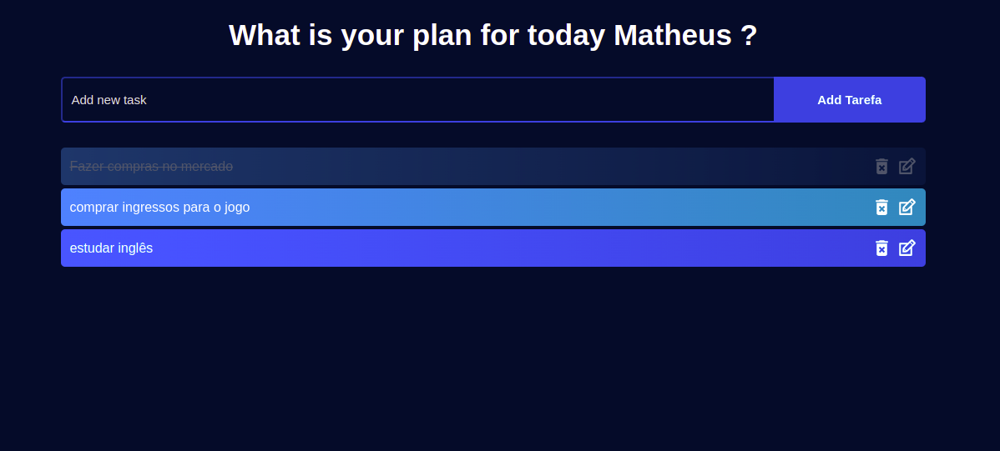

<h1 align="center"> 📝 To-do List ✏️ </h1>


## Deploy
click aqui: https://todolist-mathluiz23.vercel.app/

## 💻 Projeto

Projeto pessoal desenvolvido com intuito de organizar as tarefas do dia-a-dia.
Este projeto consiste em uma tela de login onde a pessoa informa seu nome, email e uma senha válidos para login. Após o login o usuário é encaminhado para a sua área de tarefas, onde ele poderá adicionar tarefas em uma lista, corrigir ou atualizar alguma tarefa já listada, marcá-la como realizada e deletá-la.

Ações do usuário:

 - Login
 - Inserir tarefa
 - Atualizar tarefa
 - Deletar tarefa


## Demonstração

<div align="center">
    
</div>

## Habilidades

Neste projeto, foram utilizadas as seguintes habilidades:


- Utilizar o `React` e `React Router-dom`

- Usar o componente `Navigate` pra redirecionar para uma rota específica;

- Utilizar `Hook useState` para lidar com mudanças de estado da aplicação;

- Utilizar as funcionalidade `setItem e getItem` do localStorage, para adicionar, recuperar ou excluir dados localmente.

- Utilizar o componente `BrowserRouter` corretamente;

- Criar rotas, mapeando o caminho da URL com o componente correspondente, via `Route`;


## Tela de Tarefas



## Rodando o projeto localmente

Clone o projeto

```bash
  git clone git@github.com:Mathluiz23/todolist.git
```

Entre no diretório do projeto

```bash
  cd todolist
```

Instale as dependências

```bash
  npm install
```

Inicie o projeto

```bash
  npm start
```
